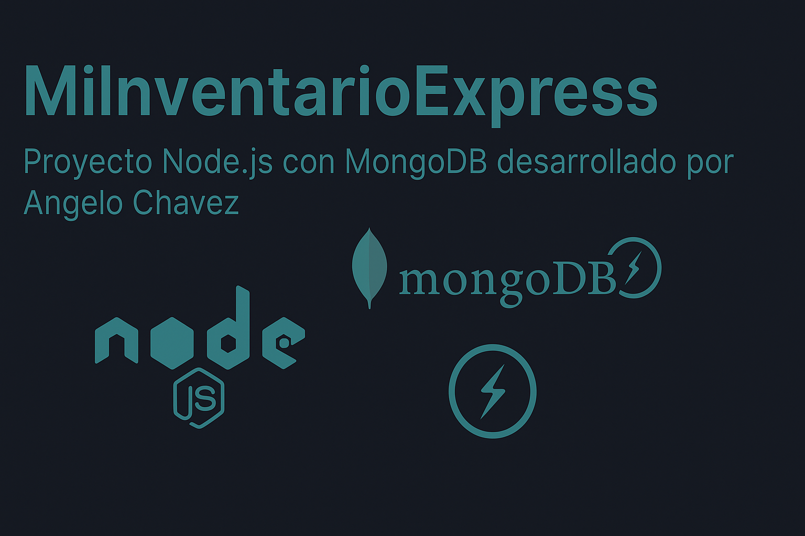

<p align="center">
  
</p>

# 🚀 MiInventarioExpress

**Aplicación de gestión de inventario con autenticación, chat en tiempo real y conexión a MongoDB.**  
Desarrollada con **Node.js**, **Express**, **MongoDB** y **Handlebars**.

---

## ✨ Características principales
✅ Validación de variables de entorno al iniciar (la app no arranca si falta configuración)
✅ Autenticación de usuarios con contraseñas encriptadas  
✅ Gestión completa de productos (CRUD: crear, leer, actualizar, eliminar)  
✅ Interfaz amigable con vistas dinámicas en Handlebars  
✅ Chat en tiempo real con **Socket.io**, con autenticación y validación de mensajes
✅ Manejo global de errores con página de error personalizada (404 y mas) 
✅ Sistema de logging con **Winton** (registro de errores en archivos)
✅ Seguridad con **Helmet** y sesiones protegidas  
✅ Persistencia de datos con **MongoDB (Mongoose)**  

---

## 🧰 Tecnologías utilizadas
| Tecnología | Descripción |
|-------------|-------------|
| **Node.js** | Entorno de ejecución del lado del servidor |
| **Express.js** | Framework para crear el servidor y las rutas |
| **MongoDB + Mongoose** | Base de datos NoSQL y ODM |
| **Bcrypt** | Encriptación de contraseñas |
| **Socket.io** | Comunicación en tiempo real |
| **Handlebars** | Motor de plantillas para las vistas |
| **Helmet** | Seguridad HTTP básica |
| **Nodemon** | Reinicio automático en desarrollo |
| **Winston** | Sistema de logging (registro de errores) |
| **express-validator** | Validación de datos de formularios |
| **connect-mongo** | Almacenamiento de sesiones en MongoDB |
---

## ⚙️ Instalación y configuración

### 1️⃣ Clonar el repositorio
```bash
git clone https://github.com/AngeloChavezZ/MiInventarioExpress.git
cd MiInventarioExpress
```

### 2️⃣ Configurar las variables de entorno

Crea un archivo `.env` en la raíz del proyecto con las siguientes variables:

| Variable | Descripción |
| --------- | ----------- |
| `MONGO_URI` | Cadena de conexión a MongoDB (ej. `mongodb://127.0.0.1:27017/miinventario`) |
| `SESSION_SECRET` | Clave secreta y aleatoria para firmar las sesiones |
| `PORT` | Puerto donde corre el servidor (ej. `3000`) |

> ⚠️ El archivo `.env` no se incluye en el repositorio por seguridad. Debes crearlo.
